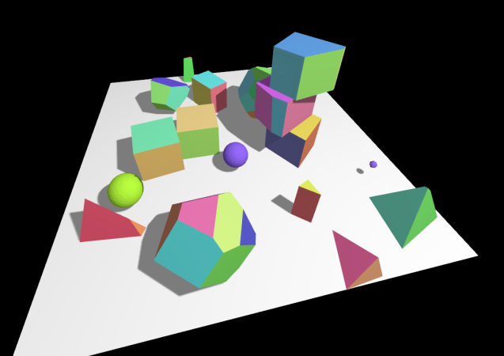
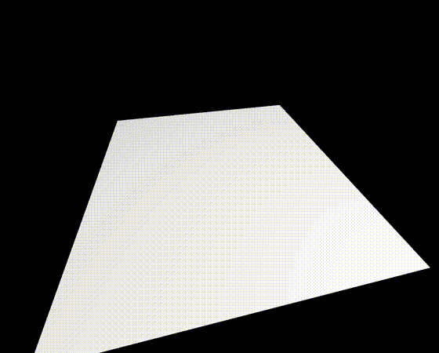
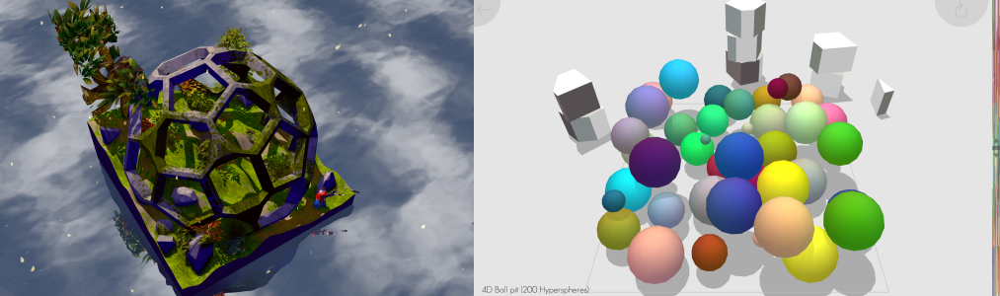
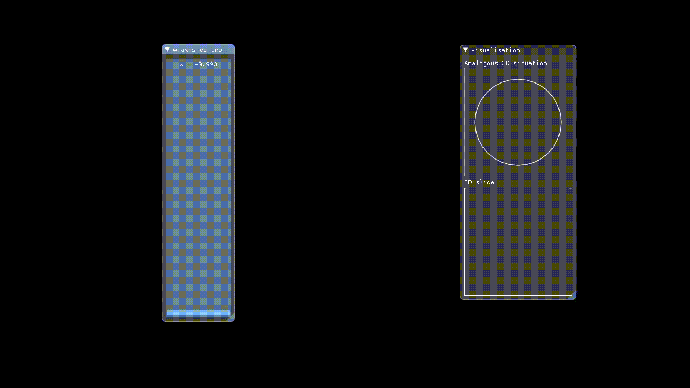
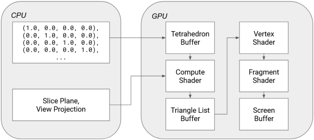
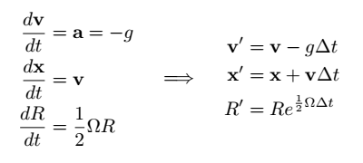

# Hypervis - 4D Renderer & Physics Engine



This is an earnest attempt at writing a renderer for 4D geometry and physics
engine for 4D objects, written for learning both
[wgpu-rs](https://github.com/gfx-rs/wgpu) and 4D geometry.

I gave a talk about this project! You can watch the talk here:
https://www.youtube.com/watch?v=_22oxXEX_xc&t=717s



## Demos

Knocking over a stack of tesseracts with a hypersphere:


Rolling a 600-cell (a 4D Platonic "solid" composed of 600 tetrahedral cells, the
equivalent of faces in 4D) around:


A domino track that appears to go "through" a wall, but in actuality goes around
it in the 4th dimension:


## Motivation

This project was largely motivated by seeing Marc ten Bosch's games,
[Miegakure](http://miegakure.com/) (still in development at the time of writing)
and [4D Toys](http://4dtoys.com/).



While there have been many implementations of 4D visualisers, I've not come
across an implementation or a good description of or even general pointers to
how to implement a physics engine in 4D. 4D Toys is the only example of an
actual 4D engine I could find, and it's closed-source.

This gave me the idea of investigating and attempting to implement a 4D physics engine. How hard could it be, right?

(Marc ten Bosch has published a paper [N-Dimensional Rigid Body
Dynamics](https://marctenbosch.com/ndphysics/) about his 4D physics engine, but
by this point most of my implementation was in place and it would've been
helpful to be able to refer to this earlier on...)

## Rendering

Hypervis implements rendering of 4D objects by only rendering a 3D slice of the
4D space to the user. The X, Y, and Z-axes have their conventional meanings, but
in addition to these the user manually controls which W-axis slice is rendered
via a slider. This means that we are showing incremental hyperplanar slices
through the 4D space.



Just like how in 3D, the surface of an object is represented in a mesh of
triangles, in 4D the surface of an object would be represented by a mesh of
tetrahedra.

To render this 4D mesh, we intersect it with the current W-slice that we are
interested in. Computing an intersection between a hyperplane and a singular
tetrahedron is not difficult - we simply apply the standard intersection test
for a line and a plane (in its point-normal representation) for each of the
edges of the tetrahedron, which gives us 4 possibilities:

-   The tetrahedron is parallel to the hyperplane. This is a degenerate
    case and can be handled by rendering the tetrahedron if it is contained
    within the hyperplane.
-   The tetrahedron is not parallel to the hyperplane, in which case we can
    consider the hyperplane of the tetrahedron, which is a 3D subspace whose
    intersection with the slice plane is a 2D plane. Thus, we can consider this
    as a problem of intersecting a tetrahedron and a 2D plane in 3D space,
    giving us 3 possibilities:
    -   no edges intersect the plane - render nothing
    -   3 edges intersect the plane - render a triangle
    -   4 edges intersect the plane - render the resulting quadrilateral


It is possible to encode "winding" data for tetrahedra so you can recover the
correctly oriented triangles for backface culling, but for simplicity I just
emitted two triangles, one in each orientation.

All of this happens on a compute shader (with the help of wgpu-rs!) written to
process a mesh of tetrahedra from a "Tetrahedron Buffer", which together with
the slice hyperplane returns a regular list of triangles that are passed down
the regular rendering pipeline.



## Rotations in 4D

For a rigid body physics engine the motion of any body can be described using
two components, the linear velocity and the angular velocity. Linear velocity is
easy - you simply store the 4D vector corresponding to the direction and speed
of motion. Angular velocity is trickier though, because how do you represent
rotations in 4D?

When talking about rotations in 3D, we usually reach for a quaternion
implementation, but quaternions are specific to rotations in 3D. To express
rotations in 4D we need to reach for a field of mathematics called Geometric
Algebra.

A basic way to conceptualise it is this - in 3D, we tend to think of rotation as
happening around an axis, but this is in fact a very 3D-centric view of looking
at it. For example, if something is rotating in a 2D space, where is the axis of
rotation? It can't exist! A more natural way to consider rotations is that they
occur in a particular plane instead:


**n** represents the axis of rotation, but equivalently the rotation could also
be described by taking the _dual_ of **n** giving us the plane **n\***. What is
**n\*** exactly though? It is an object which in geometric algebra is called a
_bivector_.

Bivectors, like their name suggests, act very similar to normal vectors, but
instead of representing a direction and a magnitude we can think of bivectors
representing a _particular plane_ and a magnitude. (A bivector also identifies
the _orientation_ of the plane as well. If you negate a bivector, you get a
bivector representing the same plane and magnitude, but the plane has flipped.)
Just like how every vector in 3D is made out of linear combinations of the 3
basis vectors, the unit X, Y, and Z vectors, every bivector in 3D is made out of
linear combinations of the 3 basis bivectors, **xy** (spanning the x and y
axes), **yz**, and **xz**.

Similar to how we can build quaternions from a scalar plus an imaginary vector,
we can build an object called a _rotor_ from a scalar plus a bivector. In fact,
quaternions and 3D rotors are _isomorphic_ - they are exactly equivalent, and
all operations on them behave exactly equivalently.


So what was the point of defining bivectors and rotors if we end up with the
exact same thing as quaternions anyway? Well, quaternions don't generalise to
4D, but rotors do! A rotor in 4D looks like this:

```rust
struct Bivec4 {
    xy: f32,
    xz: f32,
    xw: f32,
    yz: f32,
    yw: f32,
    zw: f32,
}

struct Quadvec4 {
    xyzw: f32,
}

struct Rotor4 {
    s: f32,
    b: Bivec4,
    q: QuadVec4,
}
```

You may notice bivectors in 4D actually have 6 components - this is because
there are 6 ways to combine the 4 axes resulting in 6 basis bivectors. In
addition to the bivector component there is a _quadvector_ component - this is
because N-dimensional rotors are actually elements of the even subalgebra of
G(N, 0) and not just the addition of a scalar and a bivector component.

This gives us the following update formulae for rigid body motion:


